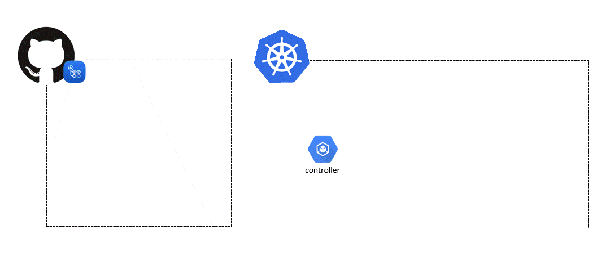
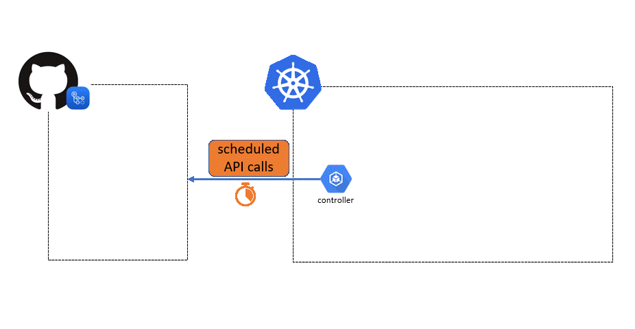

# GitHub Self Hosted Runners

The goal of this repository is to demonstrate how to use GitHub private runners on an AKS cluster by leveraging [actions-runner-controller](https://github.com/actions-runner-controller/actions-runner-controller).  

This is useful for DevOps bootstraping a project CI/CD for Azure Infra / Apps development.  

The solution is:

- Private
- Scalable
- Secured
- Cost optimized

## Scaling Options

There are 2 options for scaling:

### Webhooks driven (push scaling)

Note: in the configuration, your cluster has to be reachable from github.

### Metrics driven (pull scaling)

More information on [action-runner-controller repository](https://github.com/actions-runner-controller/actions-runner-controller#autoscaling).

## Required Tooling

- For Deployment
  - [Terraform](https://www.terraform.io/)

- For Cluster Configuration
  - [Kapp](https://carvel.dev/kapp/)
  - [Kustomize](https://kustomize.io/)

## GitHub integration

For AKS to be able to communicate with github, there are 2 possibilities:

- using an **ACCESS_TOKEN**: a GitHub Personal Access Token with at least `admin:org`, `admin:org_hook`, `notifications`, `read:public_key`, `read:repo_hook`, `repo` and `workflow` scopes.
- using a **GitHub App**: create one in your [organization](https://github.com/organizations/:org/settings/apps/new) (make sure to replace `:org` in the link by your organization name) or [account](https://github.com/settings/apps/new).
  - Note the **app_id**
  - Generate a private key, make sure to download the file as we'll need it to setup a secret
  - Install the GitHub App and note the **installation_id**
  - Add secret **GH_APP_PRIVATE_KEY** in the self hosted runners repository: the content of the private key generated in a previous step
  - Add secret **GH_ORG_WEBHOOK_ADMIN_ACCESS_TOKEN** in the self hosted runners repository: A personal access token with `admin:org_hook`, `repo` and `workflow` scopes.

For more information, see [GitHub documentation](https://docs.github.com/en/developers/apps/getting-started-with-apps/about-apps).

## Deployment

### Deploy the infrastructure

To deploy the infrastructure with Terraform, use the `cluster_deployment` folder. It contains terraform configuration to manage the AKS cluster, its network and managed identities needed as part of the solution.

### Configure the cluster

To configure the cluster with Kapp and Kustomize, generate the patches (examples are provided in the `patch_examples` directory) and the `github_app_private_key` file (to be downloaded from GitHub).
Then, run Kapp.

### Configure Github webhook

Webhook on github can be automatically configured using the terraform `github` folder.

### Test the self-hosted runners

An [example pipeline](.github/workflows/selfhosted-runner-test.yml) is provided that will request private runners. It will deploy a resource group using Terraform.

## Tips & Tricks

- AAD Pod identity being decomissionned, it should be replaced with [Azure Workload Identity](https://azure.github.io/azure-workload-identity/docs/installation.html)
- RBAC roles must be set as per [documentation](https://azure.github.io/aad-pod-identity/docs/getting-started/role-assignment/#performing-role-assignments)
- actions-runner-controller: the webhook server is not provided by default; thus a custom deployment has been added to this repository
- **Never use private runners on public repo since anyone can use them**

## Cost Simulation

Hypotheses:

- Deploying in West Europe
- Nothing else is installed on the cluster
- Pods request 500Mi of memory

| | S (B2s) | M (DS2_v2) | L (D4s_v3) |
|---|---|---|---|
| Cost for 1 Node | 29.55€ | 83.72€ | 147.75€ |
| # of runners | 1 | 9 | 22 |

Note: when using Webhooks scaling with an Application Gateway, add 90.70€ / month (could be replaced with a Nginx LB to reduce cost). This option can be disabled when setting the `enable_agic` variable to `false` (from the `cluster_deployment/variables.tf` file).
